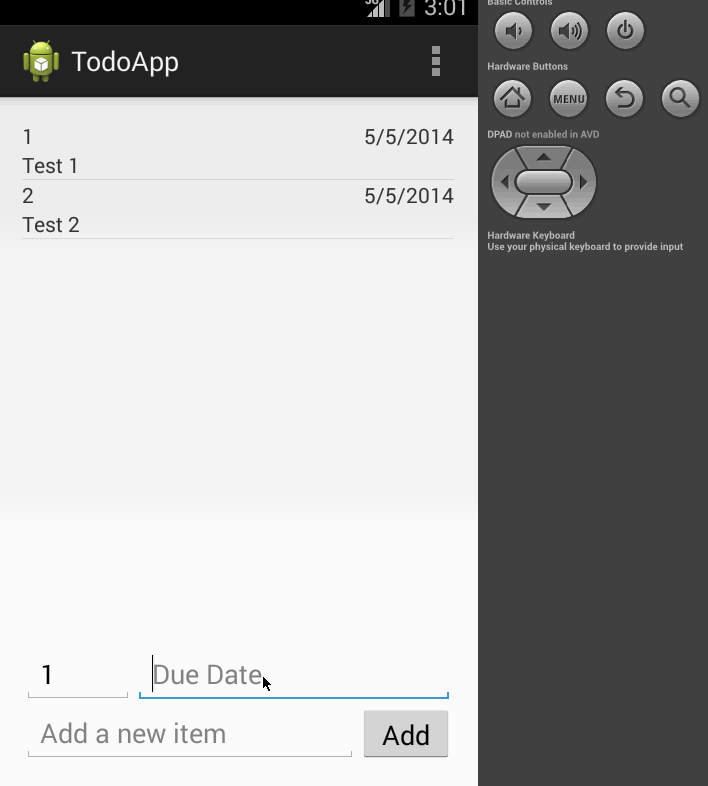

Codepath-Simple-Todo
====================
This is a simple todo android application.

Time spent: 3 hours spent in total

Completed user stories:

 * [x] Required: User can view a list of todo items
 * [x] Required: User can add to list of todo items
 * [x] Required: User can click on a todo item to edit it
 * [x] Required: User can long click on a todo item to delete it
 * [x] Optional: Todo list supports priorities and due dates with primary sort on priority and secondary sort on due date
 * [x] Optional: SQLite persistence

Walkthrough of all user stories:

GIF created with [LiceCap](http://www.cockos.com/licecap/).
